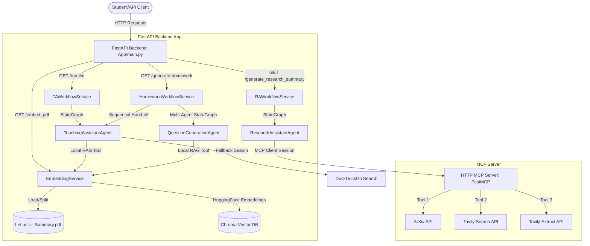

# MIT Assistant: AI Agents, RAG, and MCP Architecture Guide

Welcome to the **MIT Assistant Backend**! This repository is designed as an educational resource to teach students the core principles of modern **AI Agent Workflows**, **Retrieval-Augmented Generation (RAG)**, and the **Model Context Protocol (MCP)**. 

Through this codebase, you will learn how to orchestrate single-agent loops, multi-agent cooperative workflows, vector search systems, and dynamic tool integration over HTTP.

---

## Table of Contents
1. [Core AI Concepts Explained](#1-core-ai-concepts-explained)
2. [System Architecture](#2-system-architecture)
3. [Project Structure](#3-project-structure)
4. [Setup & Local Run Instructions](#4-setup--local-run-instructions)
5. [Agent Workflows Deep-Dive](#5-agent-workflows-deep-dive)
6. [Model Context Protocol (MCP) Integration](#6-model-context-protocol-mcp-integration)
7. [Deployment & Production Considerations](#7-deployment--production-considerations)

---

## 1. Core AI Concepts Explained

To understand this project, you need to understand four main pillars of modern AI engineering:

### A. Large Language Models (LLMs) as Reasoning Engines
Instead of using LLMs merely as text autocomplete tools, we treat them as **reasoning engines**. When given a query, a system prompt, and access to tools, the LLM decides *how* to solve a problem step-by-step:
*   It analyzes whether it has enough information.
*   If not, it requests to call a specific tool with defined arguments.
*   It receives the tool's output and continues reasoning until it can formulate a final answer.

### B. Retrieval-Augmented Generation (RAG)
LLMs have a knowledge cutoff and are prone to hallucinations when asked about specific local datasets (like the MIT AOE C Programming curriculum). RAG solves this by:
1.  **Ingestion**: Loading local documents (e.g., PDFs).
2.  **Chunking**: Splitting large texts into smaller, readable pieces (chunks) so context fits within the LLM's limit.
3.  **Embeddings**: Converting text chunks into high-dimensional vectors representing semantic meaning using an embedding model (e.g., `BAAI/bge-small-en-v1.5`).
4.  **Vector Storage**: Saving these vectors in a specialized database (Chroma DB).
5.  **Retrieval**: Searching the database for the top-K chunks closest in meaning to a user's question, then prepending them to the LLM's prompt as context.

### C. Agent Workflows & State Graphs (LangGraph)
Complex tasks require structured control flow. We use **LangGraph** to model agents as state machines:
*   **State**: A shared memory structure (e.g., a list of messages and metadata) passed from node to node.
*   **Nodes**: Python functions representing actions (e.g., invoking an LLM, running a tool).
*   **Edges**: Paths determining transition from one node to another, which can be conditional (e.g., `should_continue` checks if the LLM output requests a tool call).

### D. Model Context Protocol (MCP)
**MCP** is an open standard created by Anthropic that allows clients (like our backend app) to safely and uniformly expose tools, resources, and prompts to LLMs over standard protocols (like SSE or stdio). 
*   Instead of hardcoding APIs inside every agent, we run a separate **MCP Server** that exposes tools (like Tavily Search or arXiv lookup).
*   Our **FastAPI Backend (MCP Client)** connects to this server at runtime, inspects its available tools, and binds them to the LLM dynamically.

---

## 2. System Architecture

Below is a architectural overview of how the components interact:



---

## 3. Project Structure

Here is a breakdown of the key files in the backend:

```text
backend/
├── App/
│   ├── __init__.py
│   ├── main.py                    # Entrypoint: Exposes API routes & connects to MCP server
│   ├── agents/
│   │   ├── ta_agent.py            # Teaching Assistant Agent definition & local tools
│   │   ├── question_agent.py      # Question Generation Agent definition & prompts
│   │   └── ra_agent.py            # Research Assistant Agent using remote MCP tools
│   └── service/
│       ├── embedding_service.py   # RAG pipeline: splits, embeds & retrieves PDF data
│       ├── ta_workflow_service.py # LangGraph configuration for the TA chatbot loop
│       ├── homework_workflow_service.py # LangGraph for question generation -> answering sequence
│       └── ra_workflow_service.py # LangGraph orchestrator using MCP client tools
├── assets/
│   └── Let us c - Summary.pdf     # Source textbook summary document for RAG context
├── Dockerfile                     # Multi-stage production container build configuration
├── requirements.txt               # Backend Python package dependencies
└── .env                           # Local secrets configurations (keys)
```

---

## 4. Setup & Local Run Instructions

### Prerequisites
*   Python 3.11 installed.
*   An active **Groq API Key** (for fast, open-source model inference).
*   A **Tavily API Key** (optional, for web search tool integration).

### Step 1: Create a Virtual Environment and Install Dependencies
Navigate to the `backend` folder and run:
```bash
# Create virtual environment
python -m venv .venv

# Activate virtual environment
# On Windows:
.venv\Scripts\activate
# On macOS/Linux:
source .venv/bin/activate

# Install required packages
pip install -r requirements.txt
```

### Step 2: Configure Environment Variables
Create a `.env` file in the `backend` directory (parallel to `requirements.txt`):
```env
GROQ_API_KEY=your_groq_api_key_here
TAVILY_API_KEY=your_tavily_api_key_here
```

### Step 3: Index the PDF Documents (Initialize RAG)
Before running queries against the curriculum, split and embed the syllabus PDF. 
1. Make sure your virtual environment is active.
2. Start the FastAPI server temporarily:
   ```bash
   uvicorn App.main:app --host 0.0.0.0 --port 8000
   ```
3. Trigger the ingestion endpoint. Open your browser or run a `curl` request:
   ```bash
   curl http://localhost:8000/embed_pdf
   ```
   *Expected Response:* `{"message": "PDF embedded successfully"}`. 
   A directory named `mit_aoe_db` will be created containing the indexed sqlite/vector database.

### Step 4: Run the Backend Service
Start the server in reload/development mode:
```bash
uvicorn App.main:app --reload --host 0.0.0.0 --port 8000
```
The interactive API documentation will be available at [http://localhost:8000/docs](http://localhost:8000/docs).

---

## 5. Agent Workflows Deep-Dive

### Workflow A: Single Agent (Teaching Assistant)
*   **Service**: [ta_workflow_service.py](file:///c:/MIT%20AOE/backend/App/service/ta_workflow_service.py)
*   **Agent**: [ta_agent.py](file:///c:/MIT%20AOE/backend/App/agents/ta_agent.py)
*   **API Endpoint**: `GET /run-llm/{query}`
*   **Logic**: 
    1. The student submits a programming question (e.g., "Explain how variables work in C").
    2. The agent calls the LLM, which decides whether to read local materials using the custom tool `retrieve_data_from_pdf` or query the web with `web_search`.
    3. The agent stays in a loop (`bot_node` -> `tool_node` -> `bot_node`) until the LLM returns a final response.

### Workflow B: Multi-Agent Sequential (Homework Generator)
*   **Service**: [homework_workflow_service.py](file:///c:/MIT%20AOE/backend/App/service/homework_workflow_service.py)
*   **Agents**: [question_agent.py](file:///c:/MIT%20AOE/backend/App/agents/question_agent.py) and [ta_agent.py](file:///c:/MIT%20AOE/backend/App/agents/ta_agent.py)
*   **API Endpoint**: `GET /generate-homework/{query}`
*   **Logic**:
    1. **Agent 1 (Question Generator)** uses the RAG tool to extract details about a syllabus topic and creates a structured list of questions.
    2. The graph automatically transitions the state and hand-off message history to **Agent 2 (Teaching Assistant)**.
    3. **Agent 2** reads the generated questions and provides answers contextualized for the MIT AOE curriculum.

---

## 6. Model Context Protocol (MCP) Integration

### Workflow C: Research Assistant with Remote Tools
*   **Service**: [ra_workflow_service.py](file:///c:/MIT%20AOE/backend/App/service/ra_workflow_service.py)
*   **Agent**: [ra_agent.py](file:///c:/MIT%20AOE/backend/App/agents/ra_agent.py)
*   **API Endpoint**: `GET /generate_research_summary/{query}`
*   **Logic**:
    1. During startup (`lifespan`), the backend acts as an **MCP Client** and connects via HTTP transport to the remote MCP server:
       `https://research-mcp-server-32764074468.asia-south1.run.app/mcp`
    2. The client fetches the tools schema dynamically using `list_tools`.
    3. When running a research request (e.g., finding academic articles on "Quantum Computing"), the `ResearchAssistantAgent` uses these dynamic MCP tools (`search_arxiv`, `search_live_web`, `extract_webpage_content`) to gather information and construct a research review.

### Running a Local MCP Server
If you want to run your own tools server locally instead of connecting to Cloud Run:
1. Navigate to the `mcp/` directory.
2. Install dependencies:
   ```bash
   pip install -r requirements.txt
   ```
3. Set your `TAVILY_API_KEY` in `mcp/.env`.
4. Start the MCP server:
   ```bash
   python server.py
   ```
5. Update the backend `App/main.py` lifespan connection URL to point to your local endpoint (e.g., `http://localhost:8080/mcp`).

---

## 7. Deployment & Production Considerations

### Containerization (Docker)
Both the backend and the MCP server are ready for container deployment.

*   **Build the Backend Container**:
    ```bash
    docker build -t mit-assistant-backend -f Dockerfile .
    ```
*   **Run the Backend Container**:
    ```bash
    docker run -p 8080:8080 --env-file .env mit-assistant-backend
    ```

### Cloud Deployment (e.g., Google Cloud Run)
1. **Container Registry**: Push the Docker images to Google Artifact Registry (GAR) or Docker Hub.
2. **Deploy Service**: Deploy to Google Cloud Run, which scale down to zero when idle.
3. **Environment Variables**: Configure secrets (like `GROQ_API_KEY` and `TAVILY_API_KEY`) securely using Google Secret Manager mounted directly to the Cloud Run instances.
4. **CORS / Domain Setup**: Add API Gateway or set up path routing if exposing to a frontend application.

---

### Suggested Educational Tasks for Students
*   **Add a new tool to the MCP Server**: Edit `mcp/server.py`, write a function decorated with `@mcp.tool()`, and observe how the backend automatically detects and uses it without modifying any backend code.
*   **Adjust Chunk Parameters**: Modify the `chunk_size` and `chunk_overlap` variables inside `App/service/embedding_service.py` to see how it affects retrieval accuracy and answer quality.
*   **Build a Custom Graph Node**: Create a grading agent that evaluates answers generated by the TA agent, adding it as a final verification step in `homework_workflow_service.py`.
